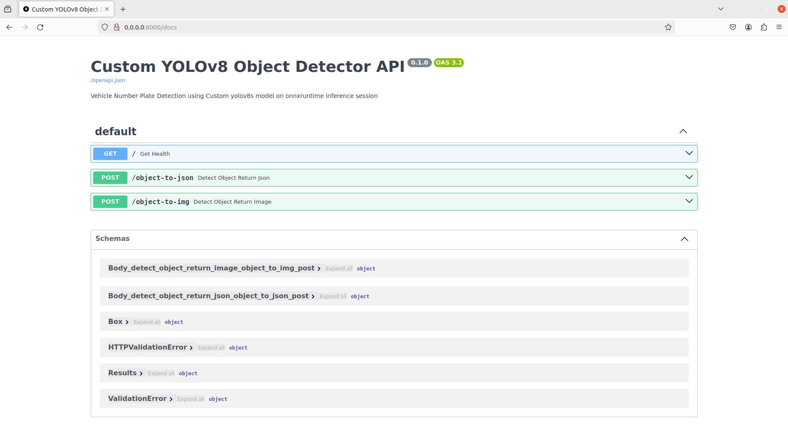
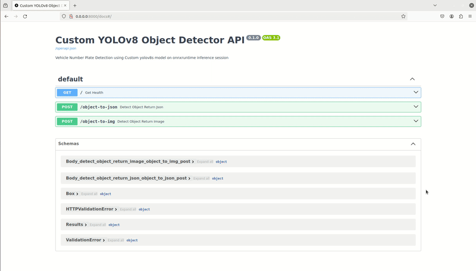

# ONNX-YOLOv8-FastAPI-Vehicle-Number-Plate-Detection

**Description**:

This cutting-edge project combines the power of YOLOv8s, FastAPI, and MongoDB to create a comprehensive vehicle license plate detection and storage system. It leverages deep learning for accurate plate detection and utilizes MongoDB for efficient data storage and management.

## Introduction
In the ever-evolving landscape of computer vision and machine learning, two powerful technologies have emerged as key players in their respective domains: YOLO (You Only Look Once) and FastAPI. YOLO has gained fame for its real-time object detection capabilities, while FastAPI has earned a reputation as one of the most efficient and user-friendly web frameworks for building APIs. In this project, we'll explore the exciting synergy that can be achieved by hosting YOLOv8, a state-of-the-art YOLO variant, using Onnxruntime with FastAPI.

First, let's briefly introduce FastAPI. FastAPI is a Python web framework that simplifies the development of APIs with incredible speed and ease. It is designed for high-performance and productivity, offering automatic generation of interactive documentation and type hints, which are a boon for developers. With FastAPI, you can build robust APIs quickly, making it an ideal choice for integrating machine learning models, like YOLOv8, into web applications.

On the other side of the equation is YOLO, a groundbreaking object detection model that has become a cornerstone of computer vision applications. YOLO excels at identifying objects in images and video streams in real-time. YOLOv8 is the latest iteration, bringing even more accuracy and speed to the table. Combining the power of YOLOv8 with the efficiency of FastAPI opens up exciting possibilities for building interactive and efficient object detection applications.

**Key Features**:

* Utilizes the YOLOv8s model, known for its accuracy and speed, for number plate detection.
* Custom dataset training ensures model adaptability to specific scenarios and environments.
* FastAPI is leveraged to serve the model as a REST API, enabling easy integration with other systems.
* Docker and Docker Compose are employed to containerize and manage the application, facilitating deployment and scalability.
* Stores detected license plate bounding boxes in a MongoDB database, enabling easy data retrieval and analysis.

**Benefits**:

* Facilitates real-time number plate detection in diverse scenarios, such as parking lots, toll booths, and traffic enforcement.
* Offers a modular and scalable architecture for integration with various systems and applications.
* Provides a well-documented and user-friendly interface for accessing the model's capabilities.

**Target Audience**:

* Developers looking to build custom number plate detection systems.
* Researchers interested in the application of deep learning for traffic and surveillance tasks.
* Businesses seeking to improve their security and automation systems.

**Usage**:

1. **Setup**:
    * Clone the repository and install the required dependencies.
    * Train the YOLOv8s model on your custom dataset or download already trained model using link below.
    * Convert the trained model to ONNX format.
    * Set up the MongoDB database.
2. **Deployment**:
    * Run the FastAPI application using Docker Compose.
      ```shell
      prompt> docker compose up --build
      [+] Running 1/0
       ✔ Container workspace-web-1  Created                                                                                                                                             0.0s 
      Attaching to web-1
      web-1  | INFO:     Will watch for changes in these directories: ['/app']
      web-1  | INFO:     Uvicorn running on http://0.0.0.0:8000 (Press CTRL+C to quit)
      web-1  | INFO:     Started reloader process [7] using StatReload
      web-1  | INFO:     Started server process [9]
      web-1  | INFO:     Waiting for application startup.
      web-1  | INFO:     Application startup complete.
      ```
      Alternatively Run the FastAPI application without docker.
      ```shell
      prompt> uvicorn main:app --reload --port 8000 --host 0.0.0.0
      INFO:     Uvicorn running on http://0.0.0.0:8000 (Press CTRL+C to quit)
      INFO:     Started reloader process [715325] using StatReload
      INFO:     Started server process [715327]
      INFO:     Waiting for application startup.
      INFO:     Application startup complete.
      ```
    * Let's navigate over to a browser at `http://0.0.0.0:8000/docs` and you'll see the swagger docs similar to the image below:
   
      
      
      Let's nevigate to /object_to_json route and upload an image, get json data as an output as shown below:

      

      Let's nevigate to /object_to_image route and upload an image, get annotated image as an output as shown below:

      
      
**Trained Model**:

* Download yolov8s onnx model trained on custom dataset\n

  [Model Link](https://drive.google.com/file/d/1KvJM6eCxFALhkhPB0oEUJk1FbAOph-Rq/view?usp=sharing)

## References
   - [https://github.com/ultralytics/ultralytics](https://github.com/ultralytics/ultralytics)
   - [https://fastapi.tiangolo.com/tutorial/](https://fastapi.tiangolo.com/tutorial/)
   - [https://github.com/microsoft/onnxruntime](https://github.com/microsoft/onnxruntime)
    

